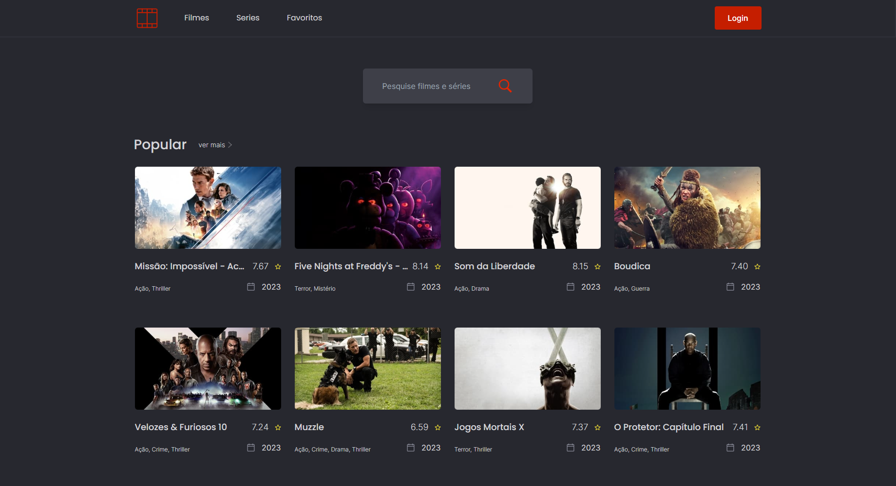

# Find a Movie!

<div align="center">
   <a href="https://github.com/AndrewBoldrin/find-a-movie">
    
  </a>
  <h3>Find a Movie</h3>
  <p>Aplicação que permite os usuários realizarem buscas por filmes e séries</p>
   <a href="https://andrewboldrin.github.io/find-a-movie/movie">Veja o projeto</a>
</div>

##



### Descrição
#### Com o find-a-movie os usuarios podem realizar pesquisas de filmes, séries e salvar seus títulos favoritos. Os dados são buscados da api do themoviedb.org. Os usuários podem salvar os títulos em uma lista de favoritos, o app usa o firebase como forma de autenticação e guardar a lista de títulos favoritos de cada usuário.

## Tecnologias, Ferramentas e Outros
- Vite
- React
   - useState
   - useEffect
   - useContext
   - hooks
- Typescript
- TailwindCSS
- Firebase
   - Auth
   - Real Database

- Axios
- Eslint
- API (https://api.themoviedb.org/3)

## Passos para uso

### Instalação

#### Primeiro clone este repositório

```
git clone https://github.com/AndrewBoldrin/find-a-movie.git
```

#### Instale as dependências

```
npm install
```

#### crie o arquivo .env

```
touch .env
```

#### Copie o contéudo do arquivo .env.exaple para o arquivo .env e então substitua os valores das variaveis com o valor real

#### Rode a aplicação

```
npm run dev
```